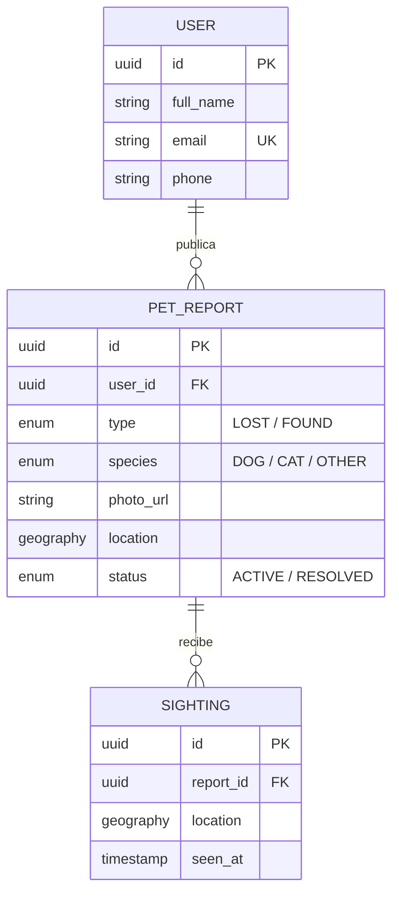

# 🐾 Proyecto: Animales Fantásticos (Equipo 5)

  

## 📋 Resumen del Proyecto

**Animales Fantásticos** es una plataforma web (PWA) diseñada para centralizar el reporte de mascotas perdidas y encontradas. A diferencia de los grupos de redes sociales, utiliza **geolocalización avanzada (PostGIS)** para permitir búsquedas precisas por cercanía y filtros dinámicos.

  

---

  

## 🚀 Definición del MVP (Producto Mínimo Viable)

  
  

1. **Reporte Rápido:** Un usuario encuentra o pierde una mascota y la publica en menos de 2 minutos.

2. **Visualización Geográfica:** Mapa interactivo con pines de animales reportados.

3. **Filtros de Búsqueda:** Filtrado por especie (Perro/Gato/Otro) y estado (Perdido/Encontrado).

4. **Contacto Directo:** Enlace a WhatsApp del rescatista/dueño para agilizar el reencuentro.

  

---

  

## 🛠️ Stack Tecnológico

* **Frontend:** React + Vite (Tailwind CSS + Shadcn/ui)

* **Backend:** Node.js con NestJS (TypeScript)

* **Base de Datos:** PostgreSQL con extensión **PostGIS**

* **ORM:** Prisma

* **Servicios:** Cloudinary (Imágenes) + Mapbox/Leaflet (Mapas) + Supabase/Clerk (Auth)

  

---

  

## 🗺️ Diagrama de Flujo y Navegación


1. **Home:** Mapa interactivo con pines.

2. **Filtros:** Slider de rango de distancia y tipo de animal.

3. **Formulario:** Subida de foto + ubicación manual (inicialmente) + descripción.

4. **Perfil:** Ver ltus publicaciones (opcional, dejarlo por si nos queda tiempo)

  

---

  

## 🗄️ Modelo de Datos Tentativo (ERD)


**Entidades base:**

* `User`: Información de contacto y autenticación.

* `PetReport`: Datos de la mascota, `Enum` de estado, URL de foto y punto geográfico (`Geography`).

* `Sightings`: Comentarios con coordenadas para avisar dónde fue visto un animal ya reportado.

  

---

  

## ⚠️ DEFINICIONES PENDIENTES EN GRUPO

Esta sección contiene puntos críticos del Canva que aún no tienen una definición técnica final:

  

1. **📍 Ubicación Manual vs. GPS:** Se decidió iniciar con **ubicación manual** en el mapa para el reporte. Falta definir si el mapa detectará la ubicación del usuario automáticamente al abrir la app para centrar la vista.

2. **🔔 Sistema de Notificaciones:** El diseño de Canva menciona "Notificaciones". Se debe definir si serán `Push` (Nativas), un centro de notificaciones `In-app`, o simplemente avisos por `Email/WhatsApp`. (Sugerencia inicial: WhatsApp directo).

3. **🛡️ Validación de Reportes:** ¿Cómo evitamos reportes falsos? Se requiere definir si el Login será obligatorio para publicar o si se puede reportar de forma anónima con validación de teléfono.

4. **🏗️ Infraestructura PostGIS:** Confirmar si el servicio de hosting (Render/Supabase) soporta las consultas espaciales necesarias para el filtrado por radio de KM.

5. **🖼️ Optimización de Imágenes:** Definir el peso máximo de subida para no saturar la transferencia de Cloudinary en el tier gratuito.

  

---

  

## 👥 Equipo (AnimalesFantásticos)

- Agus - A.Reybrienza@gmail.com

- Valen - valenfucce@gmail.com

- Fabri - fsignorello@estudiantes.unsam.edu.ar

- Emi - ejnunez@estudiantes.unsam.edu.ar

- Ale - amenini@estudiantes.unsam.edu.ar

- Maxi - maxifborrelli@gmail.com

- Anny - anny.pagano99@gmail.com

  

---

  

## 📅 Sprint 1 (03/04 - 16/04)

* **Objetivo:** Setup de entornos, diseño de base de datos y maquetado de alta fidelidad en Figma.# 🐾 Proyecto: Animales Fantásticos (Equipo 5)

  

## 📋 Resumen del Proyecto

**Animales Fantásticos** es una plataforma web (PWA) diseñada para centralizar el reporte de mascotas perdidas y encontradas. A diferencia de los grupos de redes sociales, utiliza **geolocalización avanzada (PostGIS)** para permitir búsquedas precisas por cercanía y filtros dinámicos.

  

---

  

## 🚀 Definición del MVP (Producto Mínimo Viable)

  
  

1. **Reporte Rápido:** Un usuario encuentra o pierde una mascota y la publica en menos de 2 minutos.

2. **Visualización Geográfica:** Mapa interactivo con pines de animales reportados.

3. **Filtros de Búsqueda:** Filtrado por especie (Perro/Gato/Otro) y estado (Perdido/Encontrado).

4. **Contacto Directo:** Enlace a WhatsApp del rescatista/dueño para agilizar el reencuentro.

  

---

  

## 🛠️ Stack Tecnológico

* **Frontend:** React + Vite (Tailwind CSS + Shadcn/ui)

* **Backend:** Node.js con NestJS (TypeScript)

* **Base de Datos:** PostgreSQL con extensión **PostGIS**

* **ORM:** Prisma

* **Servicios:** Cloudinary (Imágenes) + Mapbox/Leaflet (Mapas) + Supabase/Clerk (Auth)

  

---

  

## 🗺️ Diagrama de Flujo y Navegación

(esta la imagen en canva)

  

1. **Home:** Mapa interactivo con pines.

2. **Filtros:** Slider de rango de distancia y tipo de animal.

3. **Formulario:** Subida de foto + ubicación manual (inicialmente) + descripción.

4. **Perfil:** Gestión de reportes propios (marcar como "Encontrado").

  

---

  

## 🗄️ Modelo de Datos Tentativo (ERD)

(esta en discord un tentativo)

  

**Entidades base:**

* `User`: Información de contacto y autenticación.

* `PetReport`: Datos de la mascota, `Enum` de estado, URL de foto y punto geográfico (`Geography`).

* `Sightings`: Comentarios con coordenadas para avisar dónde fue visto un animal ya reportado.

  

---

  

## ⚠️ DEFINICIONES PENDIENTES EN GRUPO

Esta sección contiene puntos críticos del Canva que aún no tienen una definición técnica final:

  

1. **📍 Ubicación Manual vs. GPS:** Se decidió iniciar con **ubicación manual** en el mapa para el reporte. Falta definir si el mapa detectará la ubicación del usuario automáticamente al abrir la app para centrar la vista.

2. **🔔 Sistema de Notificaciones:** El diseño de Canva menciona "Notificaciones". Se debe definir si serán `Push` (Nativas), un centro de notificaciones `In-app`, o simplemente avisos por `Email/WhatsApp`. (Sugerencia inicial: WhatsApp directo).

3. **🛡️ Validación de Reportes:** ¿Cómo evitamos reportes falsos? Se requiere definir si el Login será obligatorio para publicar o si se puede reportar de forma anónima con validación de teléfono.

4. **🏗️ Infraestructura PostGIS:** Confirmar si el servicio de hosting (Render/Supabase) soporta las consultas espaciales necesarias para el filtrado por radio de KM.

5. **🖼️ Optimización de Imágenes:** Definir el peso máximo de subida para no saturar la transferencia de Cloudinary en el tier gratuito.

  

---

  

## 👥 Equipo (AnimalesFantásticos)

- Agus - A.Reybrienza@gmail.com

- Valen - valenfucce@gmail.com

- Fabri - fsignorello@estudiantes.unsam.edu.ar

- Emi - ejnunez@estudiantes.unsam.edu.ar

- Ale - amenini@estudiantes.unsam.edu.ar

- Maxi - maxifborrelli@gmail.com

- Anny - anny.pagano99@gmail.com

---

This is a [Next.js](https://nextjs.org) project bootstrapped with [`create-next-app`](https://nextjs.org/docs/app/api-reference/cli/create-next-app).

## Getting Started

First, run the development server:

```bash
npm run dev
# or
yarn dev
# or
pnpm dev
# or
bun dev
```

Open [http://localhost:3000](http://localhost:3000) with your browser to see the result.

You can start editing the page by modifying `app/page.tsx`. The page auto-updates as you edit the file.

This project uses [`next/font`](https://nextjs.org/docs/app/building-your-application/optimizing/fonts) to automatically optimize and load [Geist](https://vercel.com/font), a new font family for Vercel.

## Learn More

To learn more about Next.js, take a look at the following resources:

- [Next.js Documentation](https://nextjs.org/docs) - learn about Next.js features and API.
- [Learn Next.js](https://nextjs.org/learn) - an interactive Next.js tutorial.

You can check out [the Next.js GitHub repository](https://github.com/vercel/next.js) - your feedback and contributions are welcome!

## Deploy on Vercel

The easiest way to deploy your Next.js app is to use the [Vercel Platform](https://vercel.com/new?utm_medium=default-template&filter=next.js&utm_source=create-next-app&utm_campaign=create-next-app-readme) from the creators of Next.js.

Check out our [Next.js deployment documentation](https://nextjs.org/docs/app/building-your-application/deploying) for more details.


